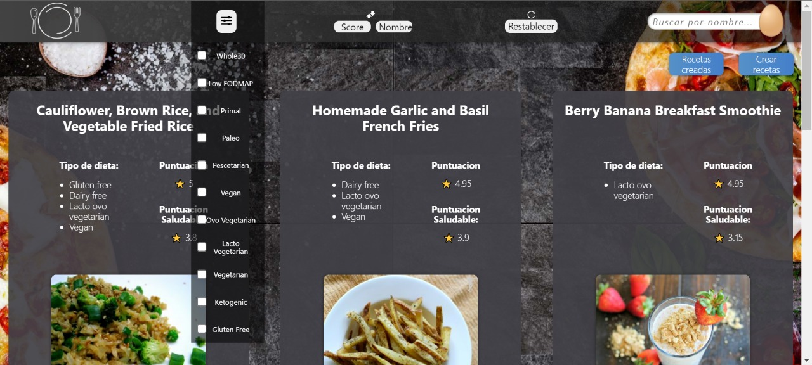
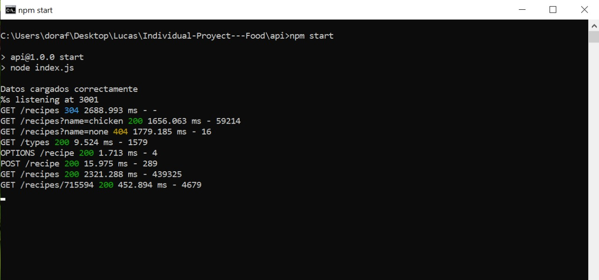
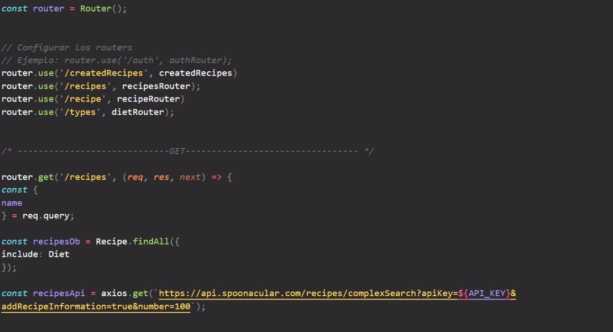
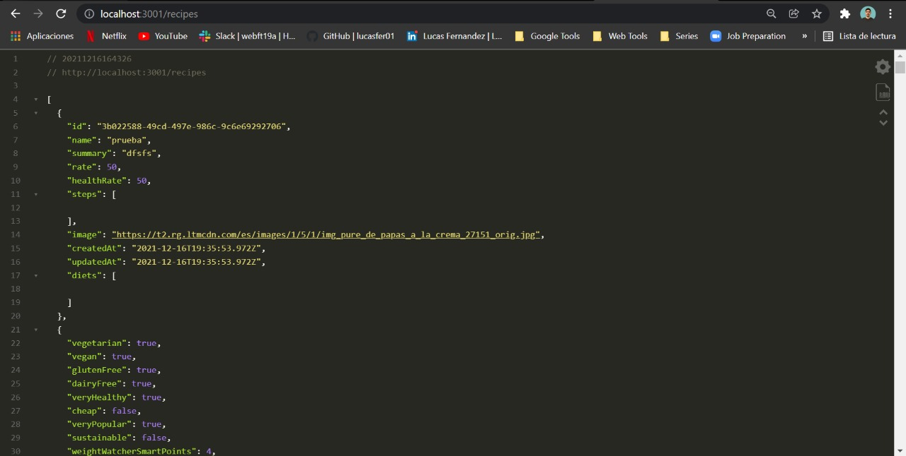
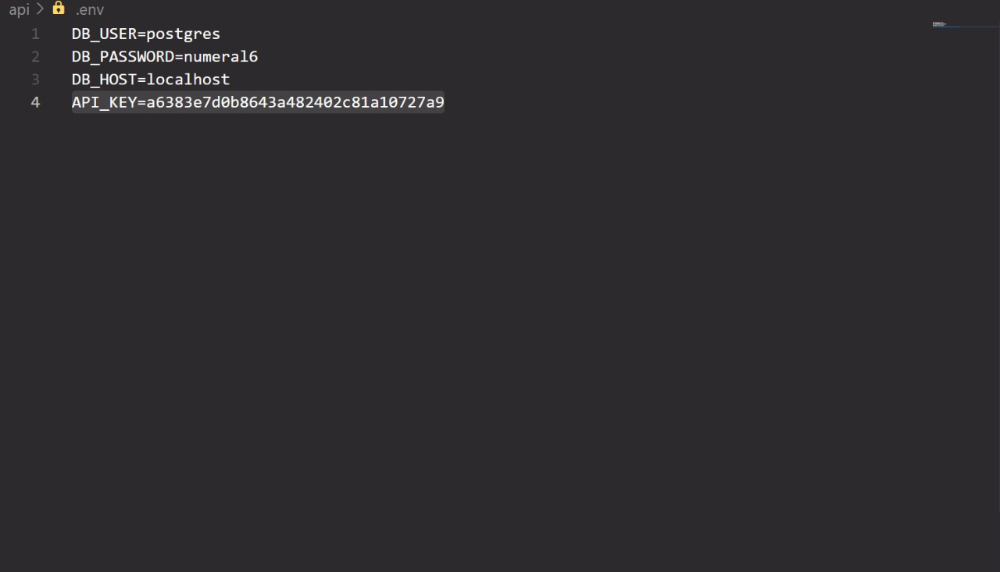

# Cooking Recipes

Proyecto individual sobre recetas de cocina realizado en el bootcamp Soy Henry con el objetivo de afianzar los conocimientos de las tecnologias aprendidas


## Como esta construida la app?

Para el Backend se utiliza `Node js` y `Express js` para levantar el servidor y `Sequelize` con `PostgreSQL` para la base de datos donde se alojaran las recetas que cree el usuario. Ademas de utilizar una api publica de [Spoonacular](https://spoonacular.com/food-api/docs) para las recetas.

Para el Frontend se utiliza `JavaScript` y `React` para la estructura, `Redux` para los estados globales y `CSS` para los estilos.


# Screenshots

## Frontend

### Landing


### Home





### Agregar recetas


### Recetas creadas


## Backend

### Respuestas




### Algunas rutas




### API



## Como usarlo localmente

Clonar el repositorio

```bash
  git clone https://github.com/lucasfer01/Cooking-Recipes.git
```

Ir a la carpeta api

```bash
  cd api
```

Instalar dependencias

```bash
  npm install
```

Levantar el servidor

```bash
  npm start
```

#### Abrir otra consola y abrir la carpeta del projecto

Ir a la carpeta client

```bash
  cd client
```

Instalar dependencias

```bash
  npm install
```

Levantar la aplicación

```bash
  npm start
```

## Variables de entorno

Para poder correr el servidor correctamente debemos crear un archivo llamado `.env` dentro de la carpeta `api`. Tambien debemos de tener instalado el PostgreSQL.

Dentro del archivo debemos crear las siguientes variables.

`DB_USER=postgres`

`DB_PASSWORD=numeral6`

`DB_HOST=localhost`

`API_KEY=a6383e7d0b8643a482402c81a10727a9`



