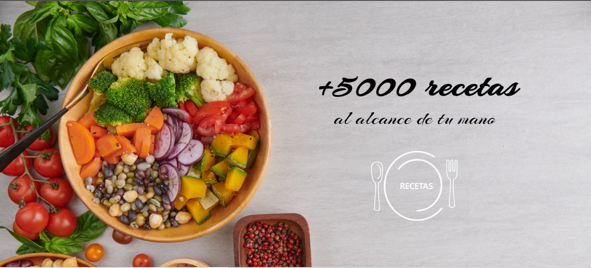
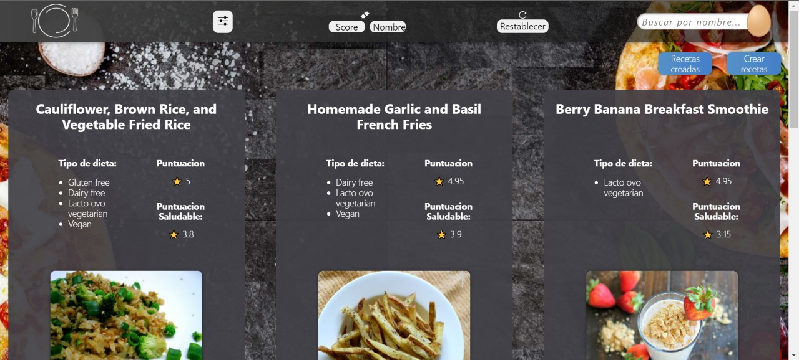
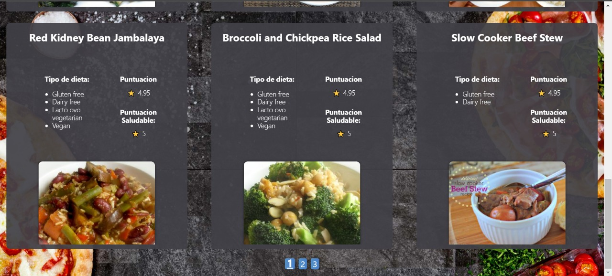
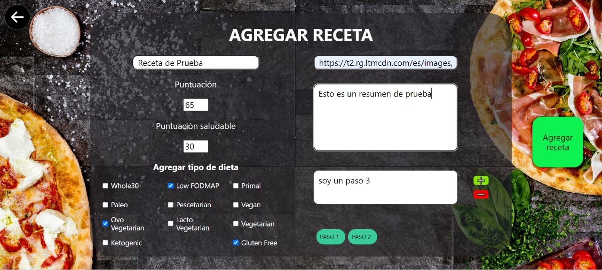
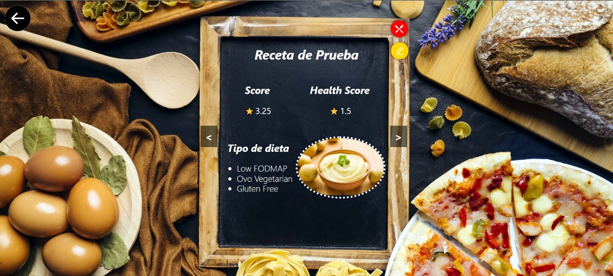

# Cooking Recipes

Proyecto individual sobre recetas de cocina realizado en el bootcamp Soy Henry con el objetivo de afianzar los conocimientos de las tecnologias aprendidas


## Como esta construida la app?

Para el Backend se utiliza Express js para levantar el servidor y Sequelize con PostgreSQL para la base de datos donde se alojaran las recetas que cree el usuario. Ademas de utilizar una api publica de [Spoonacular](https://spoonacular.com/food-api/docs) para las recetas.

Para el Frontend se utiliza  React para la estructura, Redux para los estados globales y CSS para los estilos.


## Screenshots

### Landing




### Home





### Agregar recetas




### Recetas creadas



## Como usarlo localmente

Clonar el repositorio

```bash
  git clone https://github.com/lucasfer01/Individual-Proyect---Food.git
```

Ir a la carpeta api

```bash
  cd api
```

Instalar dependencias

```bash
  npm install
```

Levantar el servidor

```bash
  npm start
```

#### Abrir otra consola y abrir la carpeta del projecto

Ir a la carpeta client

```bash
  cd client
```

Instalar dependencias

```bash
  npm install
```

Levantar la aplicación

```bash
  npm start
```

